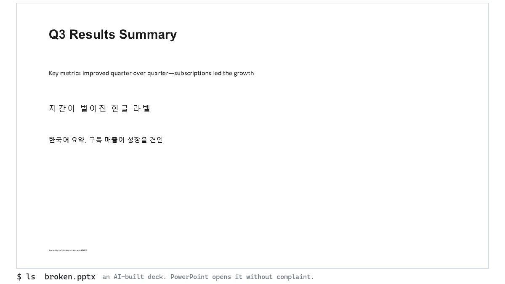
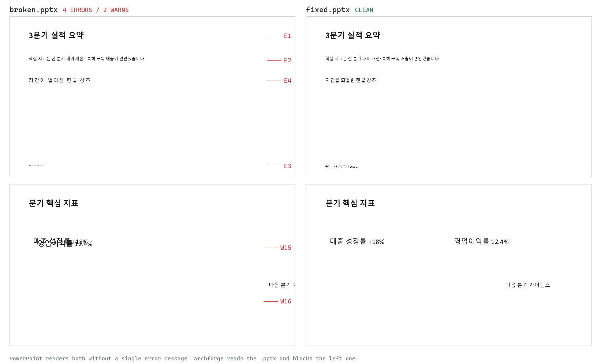

<div align="center">

# Archforge

**AI가 만든 파워포인트를 배포 전에 검사하는 프리플라이트 린터**

조용한 한글 폰트 폴백, 판독 불가 크기, 프레임 충돌, 화면 밖 잘림, AI 티 문장부호를
사람이 렌더를 보기 전에 `.pptx` 파일에서 잡아냅니다.


[](https://github.com/Love-Ash/archforge/actions/workflows/ci.yml)

[English README](README.md)



</div>

파워포인트는 이 두 덱을 아무 경고 없이 엽니다. 하나는 망가져 있습니다:



코드 리뷰로는 이걸 볼 수 없습니다. 결함이 폰트 슬롯, autofit 배율, 좌표처럼 렌더
시점에야 실체가 되는 곳에 살기 때문입니다. Archforge는 `.pptx` 내부(XML, 폰트 해석
체인, 기하, 이미지 알파)를 직접 읽으므로 파워포인트 설치 없이 에이전트와 CI가 도는
어디서든 동작합니다.

## 30초

```bash
pip install archforge
archforge demo        # broken.pptx + fixed.pptx 를 만들어 눈앞에서 바로 린트
```

그다음 본인 덱에:

```bash
archforge deck.pptx                 # 객관 결함만(core 프로파일, 기본)
archforge deck.pptx --profile full  # + AI 티·스타일 규칙: 기계 생성 덱은 이 모드
archforge deck.pptx --json          # 기계 판독용 JSON (에이전트·CI)
archforge scan decks/ --profile full   # 파일·디렉터리·글롭 여러 개를 한 번에
```

[examples/](examples/)의 덱 3종이 게이트 전부를 기대 출력과 함께 보여줍니다.

## 왜

한글 덱이 깨지는 지점은 대부분 조용합니다.

- 라틴 전용 폰트에 실린 한글은 에러 없이 Malgun으로 폴백됩니다.
- 자간(tracking)은 한글 낱자 사이를 소리 없이 벌려 놓습니다.
- autofit은 글자를 판독 불가 크기까지 줄여 놓습니다.
- 텍스트 프레임이 충돌하고, 글리프가 캔버스 밖으로 나갑니다.

기계가 만든 덱이 내는 결함이 정확히 이것들이고, LLM이 자기 산출물에서 못 보는 것도
정확히 이것들입니다. Archforge는 "빌드 성공"과 "사람이 렌더를 보고 서명"의 사이를
지키는 게이트입니다.

## 사용

```bash
archforge deck.pptx --strict        # WARN도 실패 + E2 숫자 맥락 예외 해제
archforge deck.pptx --ghost         # 페이지별 타이틀 나열(수평 논리 검토)
archforge deck.pptx --render pages/ # p01.png 형식 렌더로 이미지 위 대비(W7)까지
archforge deck.pptx --skip W14,W6   # 특정 WARN 억제(JSON에 기록됨)
archforge deck.pptx --lang ko       # 리포트 언어(기본: ARCHFORGE_LANG, 그다음 OS 로케일)
archforge deck.pptx --no-config     # 설정 파일 무시(신뢰 불가 덱을 린트할 때)
archforge deck.pptx --sarif out.sarif        # SARIF 2.1.0(GitHub code scanning)
archforge deck.pptx --write-baseline bl.json # 기존 덱을 있는 그대로 수용(베타)
archforge deck.pptx --baseline bl.json       # 이후 신규 위반만 보고
archforge deck.pptx --hard-min 5 --body-min 9 --small-min 7.5   # 크기 게이트 임계
archforge deck.pptx --w6-sim 0.95 --w6-cluster 5                # W6 반복 임계
archforge scan out/**/*.pptx --json          # 집계 JSON, 한 파일이라도 실패면 exit 1
archforge demo --dir tour                    # 데모 덱 쌍을 원하는 위치에 재생성
```

프로젝트 기본값은 덱 폴더나 작업 폴더의 `.archforge.json`(PyYAML 설치 시
`.archforge.yml`)에 둡니다. CLI 플래그가 설정 파일을 이기고, 적용된 설정 경로는
출력에 항상 표시됩니다.

```json
{ "profile": "full", "skip": ["W14"], "baseline": ".archforge-baseline.json" }
```

`--json` 출력(단일 파일. `scan --json`은 파일별 문서에 집계 summary를 얹습니다):

```json
{
  "schema_version": "1.0",
  "tool": { "name": "archforge", "version": "x.y.z" },
  "target_renderer": "powerpoint-windows",
  "file": "deck.pptx",
  "lang": "ko",
  "errors":   [{ "page": 3, "code": "E1", "message": "...", "detail": "...",
                 "location": { "shape_id": 7, "shape_name": "TextBox 6",
                               "bbox": [1.0, 2.4, 5.0, 1.0], "paragraph": 0, "run": 1,
                               "part": "/ppt/slides/slide3.xml" } }],
  "warnings": [{ "page": 5, "code": "W15", "message": "...", "detail": "...",
                 "location": { "shape_id": 4, "bbox": [1.0, 2.4, 3.1, 0.4],
                               "related": { "shape_id": 9, "bbox": [1.2, 2.5, 3.3, 0.4] } } }],
  "ghost":    [{ "page": 1, "title": "..." }],
  "summary":  { "error_count": 1, "warn_count": 2, "pass": false, "incomplete": false,
                "profile": "full", "skipped_codes": [], "baseline_suppressed": 0,
                "config": null }
}
```

`location`은 에이전트 자동 수정용 타깃입니다: 도형 id·이름, 절대 bbox(인치, 그룹
변환 반영), 문단·run 인덱스, 표 셀 `cell`=[행,열], 자동 필드(슬라이드 번호·날짜)의
`field: true`, 그리고 쌍 판정(W15/W17)의 상대 프레임 `related`. 코드(E1, W15)는 언어
무관 안정 식별자이고, 메시지 언어는 덱이 아니라 사용자를 따릅니다(`--lang` >
`ARCHFORGE_LANG` > OS 로케일).

## CI

GitHub Action(composite, PyPI에서 설치):

```yaml
jobs:
  deck-lint:
    runs-on: ubuntu-latest
    steps:
      - uses: actions/checkout@v4
      - uses: Love-Ash/archforge@v0.5.0
        with:
          files: decks/
          profile: full
          sarif: archforge.sarif
      - uses: github/codeql-action/upload-sarif@v3
        if: always()
        with:
          sarif_file: archforge.sarif
```

pre-commit:

```yaml
repos:
  - repo: https://github.com/Love-Ash/archforge
    rev: v0.5.0
    hooks:
      - id: archforge
        # args: [--profile, full]
```

## 무엇을 잡나

**ERROR** (배포 차단, exit 1)

| 코드 | 내용 |
|:----:|------|
| `E1` | 한글을 실제로 렌더할 폰트가 라틴 전용(한글 글리프 없음): 조용한 Malgun 폴백. 실효 폰트는 실측 렌더 모델로 해석(아래) |
| `E2` | 대시류 문자를 문장 부호로 사용(AI 생성 덱 1번 티). en dash로 쓴 숫자 범위(2020~2024, Q1~Q3, 5%~10% 류)와 음수 부호는 기본 통과, `--strict`는 전부 차단 |
| `E3` | 실효 크기(autofit·문단·placeholder 상속 체인 반영) 5pt 미만: 판독 불가 |
| `E4` | 연속 한글·한자에 양수 자간: 낱자가 벌어짐(가나가 섞인 런은 제외: 가나 자간은 일본어의 정상 관행) |

**WARN** (권고)

| 코드 | 내용 |
|:----:|------|
| `W1` | 본문급 프레임이 9pt 미만 |
| `W5` | 상속 체인 어디에도 크기 없음 |
| `W6` | 같은 레이아웃 골격이 4장 이상 반복 (`--w6-sim`/`--w6-cluster`로 조정) |
| `W7` | 이미지 위 텍스트 대비 낮음 (`--render` 필요) |
| `W8` | 좁은 프레임(≤4in)의 소형 CJK (목업·카드 내부) |
| `W9` | 색 세로바를 리스트 마커로 반복 |
| `W10` | 직접 그린 도식이 여러 페이지에서 반복 |
| `W11` | AI 티 카피 (버즈워드·뻔한 오프닝) |
| `W12` | 푸터 baseline 어긋남 |
| `W13` | PPT 자체 그림자·글로·3D 효과 |
| `W14` | 서술형 명사구 타이틀 (숫자+단위 타이틀은 주장으로 인정) |
| `W15` | 텍스트끼리 겹침 |
| `W16` | 화면 밖 넘침 |
| `W17` | 텍스트가 이미지 잉크 경계에 걸침 |
| `W18` | 손상·비정형 속성으로 일부 구간 검사 불능 (결과 불완전 가능, `--strict`면 실패) |

프로파일이 객관 결함과 스타일 정책을 분리하고, 0.4.0부터 기본값이 `core`입니다.
기계적 게이트만(E1/E3/E4, W1/W5/W7/W8, W15~W18) 기본으로 돌고, AI 티·관행 규칙
(E2 대시, W6 반복, W9~W14)은 `full` 옵트인입니다. 기계가 만든 덱을 검사하는 에이전트
루프라면 full이 맞는 모드입니다. `editorial`은 에디토리얼·포트폴리오 덱용(W6/W14 제외).
제외 규칙은 숨겨지는 게 아니라 실행 자체가 안 되며, 선택은 JSON summary에 기록됩니다.

## 작동 방식

`E1`의 폰트 해석은 규격 추정이 아니라 실측입니다. PowerPoint COM으로 프로브 덱을 렌더해
확정한 우선순위: run `a:ea` > lstStyle 상속 체인(도형 > 레이아웃 ph > 마스터 ph > 마스터
txStyles > defaultTextStyle) > 테마 ea(제목 placeholder는 majorFont, 그 외 minorFont;
비어있지 않으면 run `a:latin`보다 우선) > 빈 테마일 때만 run `a:latin` > OS 폴백.
기록은 [docs/CALIBRATION.md](docs/CALIBRATION.md)에 있고, 테마는 슬라이드가 실제로 쓰는
마스터의 관계로 해석하므로 멀티마스터 덱에서도 엉뚱한 테마로 판정하지 않습니다.

실효 크기도 같은 상속 체인을 해석해서, 명시 크기 없는 템플릿·placeholder 덱에서도
`E3`/`W1`/`W8`이 실제로 돕습니다. 자동 필드(`a:fld`: 슬라이드 번호·날짜)의 텍스트도
일반 run과 같은 게이트를 지나고, 줄바꿈(`a:br`)은 문장부호 문맥에서 줄바꿈으로
취급됩니다.

`W15`~`W17`은 프레임 박스가 아니라 실효 글리프·잉크 영역을 근사해서 봅니다. run별 크기,
실제 행간, autofit(퍼센트 문자열 포함), wrap 모드, 그룹 좌표 변환, 정렬, 이미지 알파
트림·크롭·flip까지 반영하고, 드롭캡·잔상 타이포·장식 블리드·카드 위 캡션 같은 의도적
연출은 제외합니다.

임계값은 취향이 아니라 캘리브레이션 결과입니다. 실덱 코퍼스 50여 개를 전수 스캔해 렌더와
대조하고, 적대적 검증(오탐을 공격하는 재현 pptx)으로 회귀 픽스처를 고정했습니다. 게이트별
임계와 근거, 실측 기록은 [docs/CALIBRATION.md](docs/CALIBRATION.md)에 있습니다.

임의 pptx가 들어와도 리포트는 살아남습니다. run·슬라이드 단위 가드가 쓰레기 속성을
흡수하고, 가드가 삼킨 구간은 `W18`과 기계 판독용 `summary.incomplete` 플래그로
표면화됩니다. CI는 `pass`와 `incomplete`를 함께 보거나 `--strict`(W18도 실패)로
돌리세요. `pass` 단독은 ERROR만 반영합니다.

> 범위에 대한 정직한 주석. 폰트 커버리지 지식(E1/E4)은 현재 한글 심층입니다. 다른
> 스크립트로 쓰인 런은 절대 오탐하지 않고(런 단위 유니코드 스크립트 판별), 일본어·중국어
> 심층 지원은 스크립트별 커버리지 표를 추가하는 방식으로 확장합니다. 세로쓰기와
> RTL·복잡 조판 스크립트의 기하 추정은 추측하지 않고 스킵 후 W18로 알립니다. 렌더 모델의
> 타겟은 PowerPoint for Windows입니다(Mac·웹·LibreOffice는 폰트 해석이 다를 수 있음).

## 에이전트 연동

LLM 에이전트가 python-pptx 류로 덱을 만드는 워크플로를 일차 사용자로 설계했습니다.

```
빌드 → archforge --profile full --json (기계 생성 덱은 AI 티 규칙까지)
→ error_count 0 그리고 incomplete false 될 때까지 수정
  (location 페이로드가 도형·run 단위로 수정 지점을 특정)
→ WARN은 렌더 보고 판단
```

Agent Skills 스킬팩(SKILL.md + YAML frontmatter 표준)이 이 루프와 코드별 수정 가이드를
에이전트에게 가르칩니다. wheel에 동봉되므로 `pip install archforge` 후
`archforge skill --install`이면 끝이고, 리포를 클론했다면 `skills/archforge-pptx-lint/`를
그대로 써도 됩니다.

린트 통과가 완성이라는 뜻은 아닙니다. 이 린터는 기계로 잡히는 결함군을 담당하고, 페이지 구성과
서사의 품질은 여전히 렌더를 보는 눈의 몫입니다.

## 기여

재현 덱이 딸린 오탐 신고가 가장 값진 기여입니다. 확인된 오탐은 영구 회귀 픽스처가
됩니다. 증거 기준(게이트는 취향이 아니라 렌더 대조로 조정)은
[CONTRIBUTING.md](CONTRIBUTING.md), 위협 모델은 [SECURITY.md](SECURITY.md)에 있습니다.

## 이름

아치포지 = arch(구조) + forge(대장간). 덱의 구조와 한글 타이포를 배포 전에 벼려
다듬는 대장간이라는 뜻입니다.

## License

MIT © Minjae Kwon (Ash)
