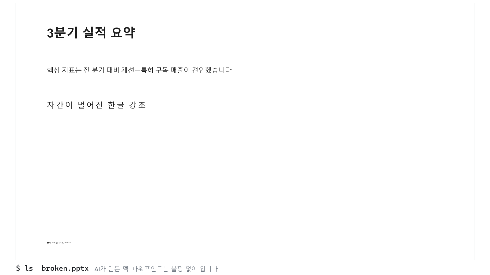
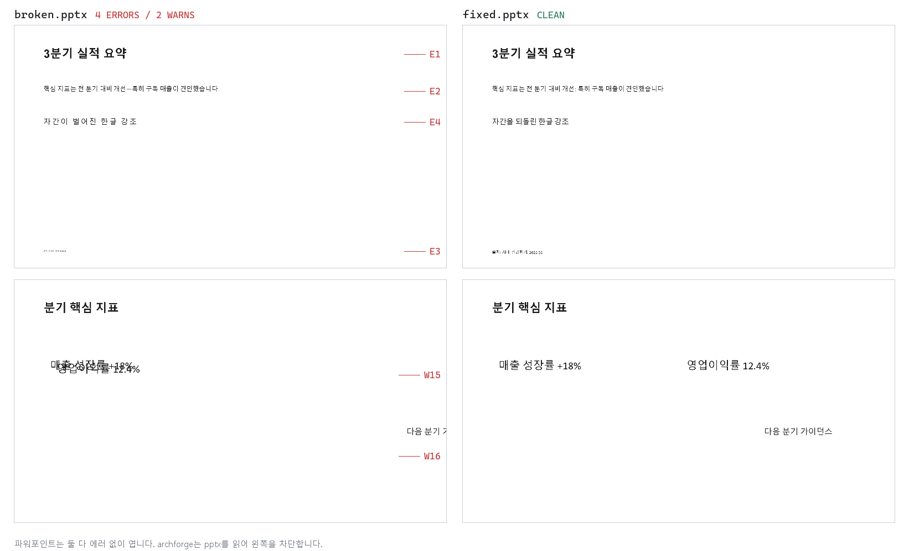

<div align="center">


**AI가 만든 파워포인트를 배포 전에 검사하는 프리플라이트 린터**

조용한 한글 폰트 폴백, 판독 불가 크기, 프레임 충돌, 화면 밖 잘림, AI 티 문장부호를
사람이 렌더를 보기 전에 `.pptx` 파일에서 잡아냅니다.

[](https://pypi.org/project/archforge/)


[](https://github.com/Love-Ash/archforge/actions/workflows/ci.yml)

[30초 시작](#30초) · [무엇을 잡나](#무엇을-잡나) · [CI](#ci) · [실측 기록](docs/CALIBRATION.md) · [코퍼스 결과](docs/ACCURACY.md) · [Discussions](https://github.com/Love-Ash/archforge/discussions) · [English README](README.md)

**AI 에이전트 / LLM:** [llms.txt](llms.txt)를 읽히거나, `pip install archforge` 후 `archforge skill --install` 이면 에이전트가 빌드-린트-수정 루프를 배웁니다.



</div>

파워포인트는 이 두 덱을 아무 경고 없이 엽니다. 하나는 망가져 있습니다:



코드 리뷰로는 이걸 볼 수 없습니다. 결함이 폰트 슬롯, autofit 배율, 좌표처럼 렌더
시점에야 실체가 되는 곳에 살기 때문입니다. Archforge는 `.pptx` 내부(XML, 폰트 해석
체인, 기하, 이미지 알파)를 직접 읽으므로 파워포인트 설치 없이 에이전트와 CI가 도는
어디서든 동작합니다.

## 30초

```bash
pip install archforge
archforge demo        # broken.pptx + fixed.pptx 를 만들어 눈앞에서 바로 린트
```

그다음 본인 덱에:

```bash
archforge deck.pptx                 # 객관 결함만(core 프로파일, 기본)
archforge deck.pptx --profile full  # + AI 티·스타일 규칙: 기계 생성 덱은 이 모드
archforge deck.pptx --json          # 기계 판독용 JSON (에이전트·CI)
archforge scan decks/ --profile full   # 파일·디렉터리·글롭 여러 개를 한 번에
```

[examples/](examples/)의 덱들이 대표 결함과 프로파일 분리를 기대 출력과 함께 보여줍니다.

## 왜

한글 덱이 깨지는 지점은 대부분 조용합니다.

- 라틴 전용 폰트에 실린 한글은 에러 없이 Malgun으로 폴백됩니다.
- 자간(tracking)은 한글 낱자 사이를 소리 없이 벌려 놓습니다.
- autofit은 글자를 판독 불가 크기까지 줄여 놓습니다.
- 텍스트 프레임이 충돌하고, 글리프가 캔버스 밖으로 나갑니다.

기계가 만든 덱이 내는 결함이 정확히 이것들이고, LLM이 자기 산출물에서 못 보는 것도
정확히 이것들입니다. Archforge는 "빌드 성공"과 "사람이 렌더를 보고 서명"의 사이를
지키는 게이트입니다.

## 사용

```bash
archforge deck.pptx --profile full --fail-incomplete --json   # 에이전트·CI 표준 명령
archforge scan decks/ --profile full         # 파일·디렉터리·글롭 여러 개를 한 번에
archforge fix deck.pptx -o fixed.pptx        # E1/E2/E4 자동 수정 (0.8.1 신규)
archforge deck.pptx --html report.html       # 주석 시각 리포트 (0.8.1 신규)
archforge deck.pptx --sarif o.sarif          # SARIF / --junit o.xml (CI 연동)
archforge rules                              # 규칙 목록, 개별 설명은 `archforge explain W15`
```

전체 플래그(임계값, baseline, severity 오버라이드, 스키마 2.0, timeout)와 설정 파일,
JSON 계약: **[docs/USAGE.md](docs/USAGE.md)** (영문). 레시피:
[Claude Code](docs/recipes/claude-code.md) ·
[Codex/에이전트](docs/recipes/codex.md) ·
[PptxGenJS](docs/recipes/pptxgenjs.md) ·
[GitHub Actions](docs/recipes/github-actions.md).


## CI

GitHub Action(composite). 액션 태그를 고정하면 린터도 고정됩니다: 기본이 PyPI 최신이
아니라 그 ref에서 체크아웃된 소스 설치입니다. 덱 폴더 설정 파일은 기본 무시
(`--no-config`)하고 검사 불완전은 기본 실패(`fail-incomplete: true`)라, PR이 덱 옆에
설정 파일을 끼워 게이트를 약화시킬 수 없습니다. `files`는 한 줄에 하나씩(경로 공백
안전), 글롭은 셸이 아니라 `archforge scan`이 직접 풀어서 `**`도 정상 동작합니다.

```yaml
jobs:
  deck-lint:
    runs-on: ubuntu-latest
    steps:
      - uses: actions/checkout@v4
      - uses: Love-Ash/archforge@v0.8.1
        with:
          files: |
            decks/
          profile: full
          sarif: archforge.sarif
      - uses: github/codeql-action/upload-sarif@v3
        if: always()
        with:
          sarif_file: archforge.sarif
```

pre-commit:

```yaml
repos:
  - repo: https://github.com/Love-Ash/archforge
    rev: v0.8.1
    hooks:
      - id: archforge
        # args: [--profile, full]
```

## 무엇을 잡나

**ERROR** (배포 차단, exit 1)

| 코드 | 내용 |
|:----:|------|
| `E1` | 한글을 실제로 렌더할 폰트가 라틴 전용(한글 글리프 없음): 조용한 Malgun 폴백. 실효 폰트는 실측 렌더 모델로 해석(아래) |
| `E2` | 대시류 문자를 문장 부호로 사용(AI 생성 덱 1번 티). en dash로 쓴 숫자 범위(2020~2024, Q1~Q3, 5%~10% 류)와 음수 부호는 기본 통과, `--strict`는 전부 차단 |
| `E3` | 실효 크기(autofit·문단·placeholder 상속 체인 반영) 5pt 미만: 판독 불가 |
| `E4` | 연속 한글·한자에 양수 자간: 낱자가 벌어짐(가나가 섞인 런은 제외: 가나 자간은 일본어의 정상 관행) |

**WARN** (권고)

| 코드 | 내용 |
|:----:|------|
| `W1` | 본문급 프레임이 9pt 미만 |
| `W5` | 상속 체인 어디에도 크기 없음 |
| `W6` | 같은 레이아웃 골격이 4장 이상 반복 (`--w6-sim`/`--w6-cluster`로 조정) |
| `W7` | 이미지 위 텍스트 대비 낮음 (`--render` 필요) |
| `W8` | 좁은 프레임(≤4in)의 소형 CJK (목업·카드 내부) |
| `W9` | 색 세로바를 리스트 마커로 반복 |
| `W10` | 직접 그린 도식이 여러 페이지에서 반복 |
| `W11` | AI 티 카피 (버즈워드·뻔한 오프닝) |
| `W12` | 푸터 baseline 어긋남 |
| `W13` | PPT 자체 그림자·글로·3D 효과 |
| `W14` | 서술형 명사구 타이틀 (숫자+단위 타이틀은 주장으로 인정) |
| `W15` | 텍스트끼리 겹침 |
| `W16` | 화면 밖 넘침 |
| `W17` | 텍스트가 이미지 잉크 경계에 걸침 |
| `W18` | 손상·비정형 속성으로 일부 구간 검사 불능 (결과 불완전 가능, `--strict`면 실패) |

프로파일이 객관 결함과 스타일 정책을 분리하고, 0.4.0부터 기본값이 `core`입니다.
기계적 게이트만(E1/E3/E4, W1/W5/W7/W8, W15~W18) 기본으로 돌고, AI 티·관행 규칙
(E2 대시, W6 반복, W9~W14)은 `full` 옵트인입니다. 기계가 만든 덱을 검사하는 에이전트
루프라면 full이 맞는 모드입니다. `editorial`은 에디토리얼·포트폴리오 덱용(W6/W14 제외).
제외 규칙은 숨겨지는 게 아니라 실행 자체가 안 되며, 선택은 JSON summary에 기록됩니다.

## 작동 방식

`E1`의 폰트 해석은 규격 추정이 아니라 실측입니다. PowerPoint COM으로 프로브 덱을 렌더해
우선순위를 확정했습니다(run `a:ea` > 문단 defRPr > lstStyle 체인 > 테마 ea > 빈 테마일 때만
`a:latin` > OS 폴백). 실효 크기도 같은 체인을 해석하고, 기하는 인셋·그룹 변환·병합 셀까지
반영해 실효 글리프·잉크 영역을 근사합니다. 검사 불완전성은 일급 출력이라(`W18` /
`summary.incomplete`), `--fail-incomplete` 하의 `summary.pass`가 정직한 게이트입니다. 폰트
커버리지는 한글 심층·CJK 인지 수준이고 다른 스크립트는 오탐하지 않으며, 타겟 렌더러는
PowerPoint for Windows입니다.

전체 모델·캘리브레이션 방법·렌더러 매트릭스·범위:
**[docs/HOW_IT_WORKS.md](docs/HOW_IT_WORKS.md)**,
[docs/CALIBRATION.md](docs/CALIBRATION.md). 1.0까지 로드맵:
[docs/ROADMAP.md](docs/ROADMAP.md).

## 에이전트 연동

LLM 에이전트가 python-pptx 류로 덱을 만드는 워크플로를 일차 사용자로 설계했습니다.

```
빌드 → archforge --profile full --fail-incomplete --json (기계 생성 덱은 AI 티 규칙까지)
→ summary.pass 될 때까지 수정 (location 페이로드가 도형·run 단위로 수정 지점을 특정)
→ WARN은 렌더 보고 판단
```

Agent Skills 스킬팩(SKILL.md + YAML frontmatter 표준)이 이 루프와 코드별 수정 가이드를
에이전트에게 가르칩니다. wheel에 동봉되므로 `pip install archforge` 후
`archforge skill --install`이면 끝이고, 리포를 클론했다면 `skills/archforge-pptx-lint/`를
그대로 써도 됩니다.

린트 통과가 완성이라는 뜻은 아닙니다. 이 린터는 기계로 잡히는 결함군을 담당하고, 페이지 구성과
서사의 품질은 여전히 렌더를 보는 눈의 몫입니다.

## 커뮤니티와 기여

- 오탐을 만났다면 [FP 템플릿으로 신고](https://github.com/Love-Ash/archforge/issues/new/choose)해 주세요. 재현 덱이 있으면 영구 회귀 픽스처가 됩니다. 이 프로젝트가 받는 가장 값진 기여입니다.
- 질문, 아이디어, 판정이 애매한 덱: [GitHub Discussions](https://github.com/Love-Ash/archforge/discussions)
- 코드 기여는 [CONTRIBUTING.md](CONTRIBUTING.md)의 증거 기준(게이트는 취향이 아니라 렌더 대조로 조정)을 보고, [good first issue](https://github.com/Love-Ash/archforge/issues?q=is%3Aissue+is%3Aopen+label%3A%22good+first+issue%22) 태그에서 시작하면 됩니다.
- 보안: [SECURITY.md](SECURITY.md)

## 이름

아치포지 = arch(구조) + forge(대장간). 덱의 구조와 한글 타이포를 배포 전에 벼려
다듬는 대장간이라는 뜻입니다.

## 만든 사람

권민재(Ash), [@Love-Ash](https://github.com/Love-Ash) ·
[LinkedIn](https://www.linkedin.com/in/a5h/). archforge가 청중보다 먼저 결함을
잡아줬다면 스타 하나가 다음 사람을 이 도구로 데려옵니다. 게이트 뒤의 실측 작업
(파워포인트가 한글 폰트를 실제로 해석하는 방식, AI 덱이 조용히 깨뜨리는 것들)을
글로 정리하고 있으니 링크드인에서 이어가 주세요.

## License

MIT © Minjae Kwon (Ash)
