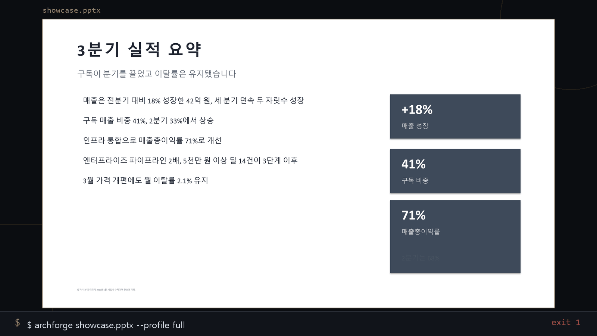
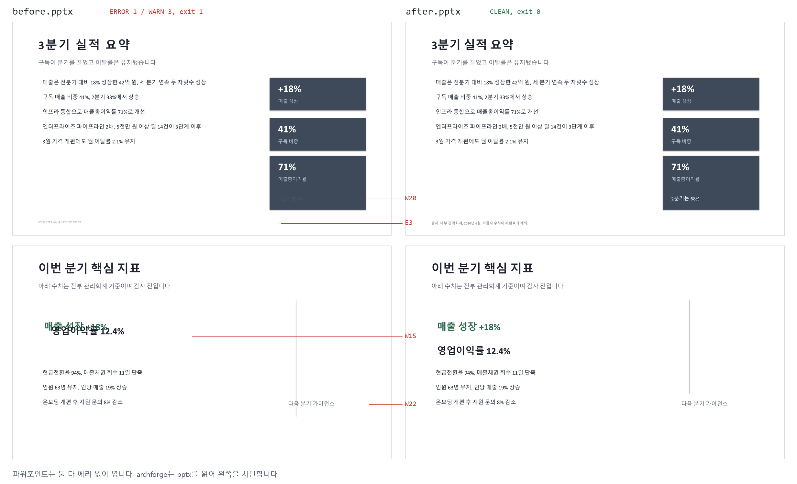
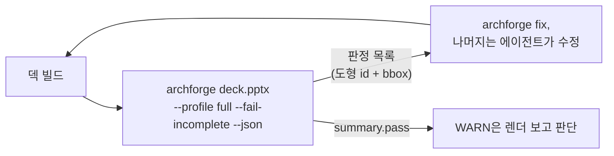

<div align="center">


**AI가 만든 파워포인트를 배포 전에 검사하는 프리플라이트 린터**

조용한 한글 폰트 폴백, 판독 불가 크기, 프레임 충돌, 화면 밖 잘림, 배경색에 묻힌
글자, AI 티 문장부호를 사람이 렌더를 보기 전에 `.pptx` 파일에서 잡아냅니다.

**설치 없이 브라우저에서 바로 검사할 수 있습니다(파일은 전송되지 않습니다):** [love-ash.github.io/archforge](https://love-ash.github.io/archforge/)

[](https://pypi.org/project/archforge/)


[](https://github.com/Love-Ash/archforge/actions/workflows/ci.yml)

[30초 시작](#30초) · [무엇을 잡나](#무엇을-잡나) · [CI](#ci) · [실측 기록](docs/CALIBRATION.md) · [코퍼스 결과](docs/ACCURACY.md) · [Discussions](https://github.com/Love-Ash/archforge/discussions) · [English README](README.md)

**AI 에이전트 / LLM:** [llms.txt](llms.txt)를 읽히거나, `pip install archforge` 후 `archforge skill --install` 이면 에이전트가 빌드-린트-수정 루프를 배웁니다.



<sub>이 문서의 데모 자산은 전시용으로 따로 만든 쇼케이스 덱입니다. `archforge demo`가
만드는 덱이나 `archforge fix` 산출물이 아니며, 덱·렌더·애니메이션 전부
`python scripts/make_readme_assets.py`로 재현됩니다.</sub>

</div>

파워포인트는 이 두 덱을 아무 경고 없이 엽니다. 하나는 망가져 있습니다:

<picture>
  <source media="(prefers-color-scheme: dark)" srcset="docs/assets/showcase-ko-dark.png">
  
</picture>

코드 리뷰로는 이걸 볼 수 없습니다. 결함이 폰트 슬롯, autofit 배율, 좌표처럼 렌더
시점에야 실체가 되는 곳에 살기 때문입니다. Archforge는 `.pptx` 내부(XML, 폰트 해석
체인, 기하, 이미지 알파)를 직접 읽으므로 파워포인트 설치 없이 에이전트와 CI가 도는
어디서든 동작합니다.

## 30초

```bash
pip install archforge
archforge demo        # broken.pptx + fixed.pptx 를 만들어 눈앞에서 바로 린트
```

그다음 본인 덱에:

```bash
archforge deck.pptx                 # 객관 결함만(core 프로파일, 기본)
archforge deck.pptx --profile full  # + AI 티·스타일 규칙: 기계 생성 덱은 이 모드
archforge deck.pptx --json          # 기계 판독용 JSON (에이전트·CI)
archforge scan decks/ --profile full   # 파일·디렉터리·글롭 여러 개를 한 번에
```

[examples/](examples/)의 덱들이 대표 결함과 프로파일 분리를 기대 출력과 함께 보여줍니다.

> [!TIP]
> 터미널이 없어도 됩니다. [love-ash.github.io/archforge](https://love-ash.github.io/archforge/)에
> pptx를 끌어다 놓으면 모든 게이트가 브라우저 안에서 돌고, 파일은 페이지를 떠나지 않습니다.

## 왜

한글 덱이 깨지는 지점은 대부분 조용합니다.

- 라틴 전용 폰트에 실린 한글은 에러 없이 Malgun으로 폴백됩니다.
- 자간(tracking)은 한글 낱자 사이를 소리 없이 벌려 놓습니다.
- autofit은 글자를 판독 불가 크기까지 줄여 놓습니다.
- 텍스트 프레임이 충돌하고, 글리프가 캔버스 밖으로 나갑니다.
- 글자 색이 뒤에 깔린 것과 거의 같아져 사실상 안 보이게 됩니다. 유령 플레이스홀더,
  차트 패널에 묻힌 캡션, 슬라이드 배경에 스며든 라벨이 이 부류입니다.

기계가 만든 덱이 내는 결함이 정확히 이것들이고, LLM이 자기 산출물에서 못 보는 것도
정확히 이것들입니다. Archforge는 "빌드 성공"과 "사람이 렌더를 보고 서명"의 사이를
지키는 게이트입니다. 저작 도구와는 의도적으로 분리돼 있습니다: python-pptx든
PptxGenJS든 OfficeCLI든 PowerPoint 자체든, 같은 파일이 들어가면 같은 exit code가
나오고, [공개 코퍼스](corpus/)가 네 가지 작성기의 픽스처로 이를 강제합니다.

## 사용

```bash
archforge deck.pptx --profile full --fail-incomplete --json   # 에이전트·CI 표준 명령
archforge scan decks/ --profile full         # 파일·디렉터리·글롭 여러 개를 한 번에
archforge fix deck.pptx -o fixed.pptx        # 기계적 수정 셋: 폰트 슬롯, 자간, 대시
archforge deck.pptx --html report.html       # 주석 시각 리포트
archforge deck.pptx --sarif o.sarif          # SARIF / --junit o.xml (CI 연동)
archforge rules                              # 규칙 목록, 개별 설명은 `archforge explain W15`
```

전체 플래그(임계값, baseline, severity 오버라이드, 스키마 2.0, timeout)와 설정 파일,
JSON 계약: **[docs/USAGE.md](docs/USAGE.md)** (영문). 레시피:
[Claude Code](docs/recipes/claude-code.md) ·
[Codex/에이전트](docs/recipes/codex.md) ·
[PptxGenJS](docs/recipes/pptxgenjs.md) ·
[OfficeCLI](docs/recipes/officecli.md) ·
[GitHub Actions](docs/recipes/github-actions.md).


## CI

GitHub Action(composite). 액션 태그를 고정하면 린터도 고정됩니다: 기본이 PyPI 최신이
아니라 그 ref에서 체크아웃된 소스 설치입니다. 덱 폴더 설정 파일은 기본 무시
(`--no-config`)하고 검사 불완전은 기본 실패(`fail-incomplete: true`)라, PR이 덱 옆에
설정 파일을 끼워 게이트를 약화시킬 수 없습니다. `files`는 한 줄에 하나씩(경로 공백
안전), 글롭은 셸이 아니라 `archforge scan`이 직접 풀어서 `**`도 정상 동작합니다.

```yaml
jobs:
  deck-lint:
    runs-on: ubuntu-latest
    steps:
      - uses: actions/checkout@v4
      - uses: Love-Ash/archforge@v0.11.0
        with:
          files: |
            decks/
          profile: full
          sarif: archforge.sarif
      - uses: github/codeql-action/upload-sarif@v3
        if: always()
        with:
          sarif_file: archforge.sarif
```

pre-commit:

```yaml
repos:
  - repo: https://github.com/Love-Ash/archforge
    rev: v0.11.0
    hooks:
      - id: archforge
        # args: [--profile, full]
```

## 무엇을 잡나

코드를 누르면 그 규칙의 전문이 나옵니다. 무엇이 걸리고 무엇이 일부러 통과하는지,
임계값이 어느 실측에서 나왔는지까지(규칙 문서는 영문).

**ERROR** (배포 차단, exit 1)

| 코드 | 내용 |
|:----:|------|
| [`E1`](docs/rules/E1.md) | 한글을 실제로 렌더할 폰트가 라틴 전용: 조용한 Malgun 폴백. 실효 폰트는 실측 렌더 모델로 해석 |
| [`E2`](docs/rules/E2.md) | 대시류 문자를 문장 부호로 사용(AI 생성 덱 1번 티). 숫자 범위와 음수 부호는 기본 통과, `--strict`는 전부 차단 |
| [`E3`](docs/rules/E3.md) | 실효 크기(autofit·상속 체인 반영) 5pt 미만: 판독 불가 |
| [`E4`](docs/rules/E4.md) | 연속 한글·한자에 양수 자간(가나 섞인 런은 제외) |

**WARN** (권고)

| 코드 | 내용 |
|:----:|------|
| [`W1`](docs/rules/W1.md) | 본문급 프레임이 9pt 미만 |
| [`W5`](docs/rules/W5.md) | 상속 체인 어디에도 크기 없음 |
| [`W6`](docs/rules/W6.md) | 같은 레이아웃 골격이 4장 이상 반복 |
| [`W7`](docs/rules/W7.md) | 이미지 위 텍스트 대비 낮음 (`--render` 필요) |
| [`W8`](docs/rules/W8.md) | 좁은 프레임(≤4in)의 소형 CJK (목업·카드 내부) |
| [`W9`](docs/rules/W9.md) | 색 세로바를 리스트 마커로 반복 |
| [`W10`](docs/rules/W10.md) | 직접 그린 도식이 여러 페이지에서 반복 |
| [`W11`](docs/rules/W11.md) | AI 티 카피 (버즈워드·뻔한 오프닝) |
| [`W12`](docs/rules/W12.md) | 푸터 baseline 어긋남 |
| [`W13`](docs/rules/W13.md) | PPT 자체 그림자·글로·3D 효과 |
| [`W14`](docs/rules/W14.md) | 서술형 명사구 타이틀 (숫자+단위 타이틀은 주장으로 인정) |
| [`W15`](docs/rules/W15.md) | 텍스트끼리 겹침 |
| [`W16`](docs/rules/W16.md) | 화면 밖 넘침 |
| [`W17`](docs/rules/W17.md) | 텍스트가 이미지 잉크 경계에 걸침 |
| [`W18`](docs/rules/W18.md) | 일부 구간 검사 불능: 결과 불완전, `--strict`면 실패 |
| [`W19`](docs/rules/W19.md) | 글자 색이 자기 상자 채움색과 거의 같음: 유령 플레이스홀더 |
| [`W20`](docs/rules/W20.md) | 뒤에 그려진 것에 글자가 묻힘. 슬라이드 배경과 벡터 차트 내부까지 판정 |
| [`W21`](docs/rules/W21.md) | 지배색 바로 옆에 거의 같은 색이 몇 번만 칠해짐: 색 오타의 형태 |
| [`W22`](docs/rules/W22.md) | 가는 괘선에 관통당한 글자: 의도하지 않은 취소선 |

W1과 W8 사이에는 의도된 공백이 있습니다. 본문급도 아니고 좁은 프레임도 아닌 자리의
5.0~9.0pt 텍스트는 판정하지 않습니다. 실덱 29개의 해당 구간 1,231개 런이 전부 저작권
표기·워터마크·페이지 번호 같은 지면 비품이었고 읽으라고 쓴 내용은 0건이었기 때문입니다.
이 실측은 재실행 가능하고, 이 구간의 실제 미검출 제보가 가장 값진 픽스처입니다.

프로파일이 객관 결함과 스타일 정책을 분리하고, 0.4.0부터 기본값이 `core`입니다.
### 프로파일

| 프로파일 | 도는 것 | 용도 |
|:---------|:--------|:-----|
| `core` (기본) | 기계적 게이트: E1/E3/E4, W1/W5/W7/W8, W15~W18 | 어떤 덱이든, 스타일 정책 없음 |
| `full` | 전부: E2 대시, W6 반복, W9~W14에 소크 중인 가시성 게이트 W19~W22까지 | 기계 생성 덱과 에이전트 루프 |
| `editorial` | full에서 W6·W14와 소크 중인 W19~W22 제외 | 에디토리얼·포트폴리오 덱 |

제외 규칙은 숨겨지는 게 아니라 실행 자체가 안 되며, 선택은 JSON summary에 기록됩니다.

## 작동 방식

`E1`의 폰트 해석은 규격 추정이 아니라 실측입니다. PowerPoint COM으로 프로브 덱을 렌더해
우선순위를 확정했습니다(run `a:ea` > 문단 defRPr > lstStyle 체인 > 테마 ea > 빈 테마일 때만
`a:latin` > OS 폴백). 실효 크기도 같은 체인을 해석하고, 기하는 인셋·그룹 변환·병합 셀까지
반영해 실효 글리프·잉크 영역을 근사합니다. 검사 불완전성은 일급 출력이라(`W18` /
`summary.incomplete`), `--fail-incomplete` 하의 `summary.pass`가 정직한 게이트입니다. 폰트
커버리지는 한글 심층·CJK 인지 수준이고 다른 스크립트는 오탐하지 않으며, 타겟 렌더러는
PowerPoint for Windows입니다.

가시성 게이트(W19~W22)도 렌더 없이 XML의 색과 기하만 읽습니다. 글자 뒤에 실제로
무엇이 그려지는지는 페인트 순서를 위에서부터 소진하며 판정하므로, 위에 얹힌 카드가
먼저 자기 겹침을 가져가고 그다음에야 슬라이드 배경을 봅니다. svgBlip 벡터 그림으로
들어간 차트는 내부를 열어 같은 기준으로 판정하고, 해석이 안 되는 채움은 추측하는
대신 기권합니다. 임계값은 폰트 모델과 같은 방식의 실측입니다. 대비 2.0:1은 실덱
29개의 후보 전수 확인에서, W21의 색 오타 판정 형태는 148덱에서 나왔습니다.

전체 모델·캘리브레이션 방법·렌더러 매트릭스·범위:
**[docs/HOW_IT_WORKS.md](docs/HOW_IT_WORKS.md)**,
[docs/CALIBRATION.md](docs/CALIBRATION.md). 1.0까지 로드맵:
[docs/ROADMAP.md](docs/ROADMAP.md). 무엇이 고정이고 무엇이 바뀔 수 있는지:
[docs/DEPRECATION.md](docs/DEPRECATION.md).

## 에이전트 연동

LLM 에이전트가 python-pptx 류로 덱을 만드는 워크플로를 일차 사용자로 설계했습니다.


```mermaid
flowchart LR
    A["덱 빌드"] --> B["archforge deck.pptx<br/>--profile full --fail-incomplete --json"]
    B -->|"판정 목록<br/>(도형 id + bbox)"| C["archforge fix,<br/>나머지는 에이전트가 수정"]
    C --> A
    B -->|"summary.pass"| D["WARN은 렌더 보고 판단"]
```

`summary.pass`는 활성 정책(`summary.policy`) 기준이고, 판정마다 location 페이로드가
도형과 run 단위로 수정 지점을 특정하므로 고치는 쪽이 검색할 필요가 없습니다.

Agent Skills 스킬팩(SKILL.md + YAML frontmatter 표준)이 이 루프와 코드별 수정 가이드를
에이전트에게 가르칩니다. wheel에 동봉되므로 `pip install archforge` 후
`archforge skill --install`이면 끝이고, 리포를 클론했다면 `skills/archforge-pptx-lint/`를
그대로 써도 됩니다.

린트 통과가 완성이라는 뜻은 아닙니다. 이 린터는 기계로 잡히는 결함군을 담당하고, 페이지 구성과
서사의 품질은 여전히 렌더를 보는 눈의 몫입니다.

## 커뮤니티와 기여

- 오탐을 만났다면 [FP 템플릿으로 신고](https://github.com/Love-Ash/archforge/issues/new/choose)해 주세요. 재현 덱이 있으면 영구 회귀 픽스처가 됩니다. 이 프로젝트가 받는 가장 값진 기여입니다.
- 질문, 아이디어, 판정이 애매한 덱: [GitHub Discussions](https://github.com/Love-Ash/archforge/discussions)
- 코드 기여는 [CONTRIBUTING.md](CONTRIBUTING.md)의 증거 기준(게이트는 취향이 아니라 렌더 대조로 조정)을 보고, [good first issue](https://github.com/Love-Ash/archforge/issues?q=is%3Aissue+is%3Aopen+label%3A%22good+first+issue%22) 태그에서 시작하면 됩니다.
- 보안: [SECURITY.md](SECURITY.md)

## 이름

아치포지 = arch(구조) + forge(대장간). 덱의 구조와 한글 타이포를 배포 전에 벼려
다듬는 대장간이라는 뜻입니다.

## 만든 사람

권민재(Ash), [@Love-Ash](https://github.com/Love-Ash) ·
[LinkedIn](https://www.linkedin.com/in/a5h/). archforge가 청중보다 먼저 결함을
잡아줬다면 스타 하나가 다음 사람을 이 도구로 데려옵니다. 게이트 뒤의 실측 작업
(파워포인트가 한글 폰트를 실제로 해석하는 방식, AI 덱이 조용히 깨뜨리는 것들)을
글로 정리하고 있으니 링크드인에서 이어가 주세요.

## License

MIT © Minjae Kwon (Ash)
