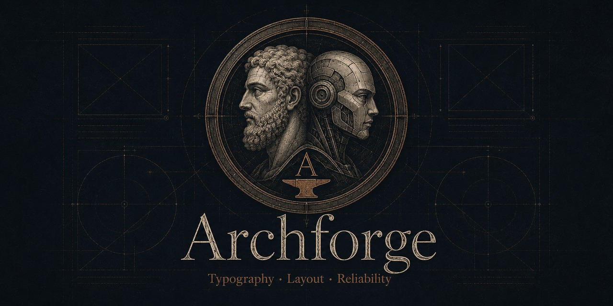
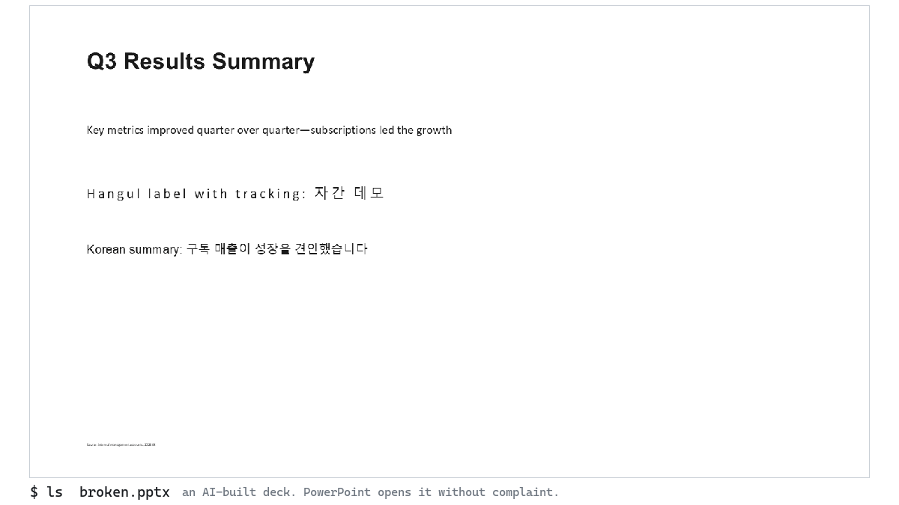
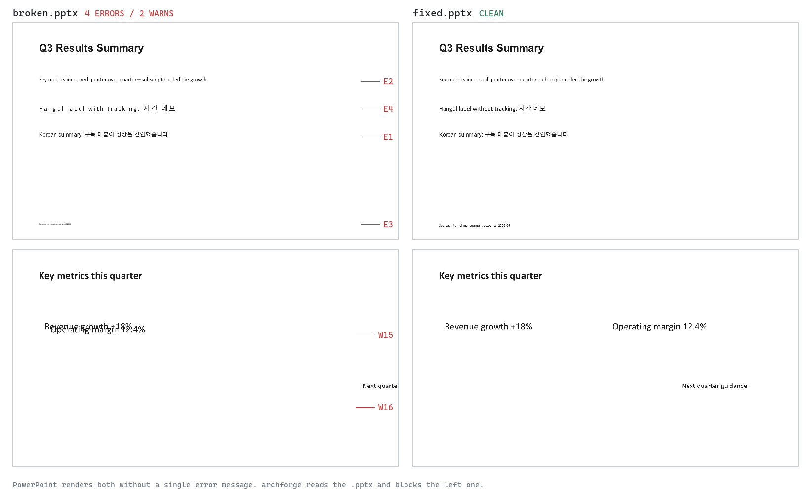

<div align="center">



**The preflight linter for AI-generated PowerPoint.**

Catches silent font fallback, unreadable sizes, colliding frames,
off-canvas text, and AI-tell punctuation in built `.pptx` files,
before a human ever sees a render.

[](https://pypi.org/project/archforge/)


[](https://github.com/Love-Ash/archforge/actions/workflows/ci.yml)

[Quickstart](#30-seconds) · [What it catches](#what-it-catches) · [CI](#ci) · [Calibration record](docs/CALIBRATION.md) · [Discussions](https://github.com/Love-Ash/archforge/discussions) · [한국어 README](README.ko.md)

**AI agents / LLMs:** read [llms.txt](llms.txt), or `pip install archforge` then `archforge skill --install` to teach your agent the build-lint-fix loop.



</div>

PowerPoint opens both of these decks without a single warning. One of them is broken:



Code review cannot see any of it, because the defects live in font slots, autofit
scales, and coordinates that only materialize at render time. Archforge reads the
`.pptx` itself (XML, font-resolution chain, geometry, image alpha), so it needs no
PowerPoint installation and runs anywhere your agent or CI runs.

## 30 seconds

```bash
pip install archforge
archforge demo        # builds broken.pptx + fixed.pptx and lints both, in front of you
```

Then point it at your own deck:

```bash
archforge deck.pptx                 # objective defects only (core profile, the default)
archforge deck.pptx --profile full  # + AI-tell / style rules: machine-made decks want this
archforge deck.pptx --json          # machine-readable JSON (agents / CI)
archforge scan decks/ --profile full   # many files, directories, or globs in one run
```

The decks in [examples/](examples/) demonstrate the flagship defects and the profile
split, each with expected outputs.

## Why

The worst pptx defects are silent. No error is raised when:

- text lands on a font that lacks its glyphs and silently falls back to an OS default
  (the classic case: CJK text on a Latin-only font)
- positive letter-spacing quietly wrecks CJK character spacing
- autofit shrinks text below readable size
- text frames collide, or glyphs run off the canvas

These are exactly the defects machine-generated decks produce, and exactly the ones
an LLM cannot see in its own output. Archforge is the gate between "the build
succeeded" and "a human would sign off on the render."

## Usage

```bash
archforge deck.pptx --fail-incomplete   # incomplete checks (W18) fail: recommended in CI
archforge deck.pptx --fail-on-warning   # WARNs fail too
archforge deck.pptx --e2-no-exemptions  # E2 numeric-range/minus exemptions off (full profile)
archforge deck.pptx --strict            # union of the three flags above
archforge deck.pptx --ghost         # per-page title list (horizontal-logic review)
archforge deck.pptx --render pages/ # add on-image contrast check (W7) from p01.png-style renders
archforge deck.pptx --skip W14,W6   # suppress specific WARNs (recorded in JSON)
archforge deck.pptx --lang en       # report language (default: ARCHFORGE_LANG, then OS locale)
archforge deck.pptx --no-config     # ignore config files (linting untrusted decks)
archforge deck.pptx --sarif out.sarif        # SARIF 2.1.0 (GitHub code scanning)
archforge deck.pptx --junit out.xml          # JUnit XML (Jenkins/GitLab test reports)
archforge deck.pptx --json --schema 2        # schema 2.0: findings[] + severity + data + capabilities
archforge deck.pptx --timeout 60             # wall-clock limit, isolated in a child process
archforge deck.pptx --write-baseline bl.json # adopt an existing deck as-is (beta)
archforge deck.pptx --baseline bl.json       # report only new findings after that
archforge deck.pptx --hard-min 5 --body-min 9 --small-min 7.5   # size gate thresholds
archforge deck.pptx --w6-sim 0.95 --w6-cluster 5                # W6 repetition thresholds
archforge scan out/**/*.pptx --json          # aggregated JSON; exit 1 if any file fails
                                             # (an input matching nothing exits 2)
archforge rules                              # one-line summary of every rule
archforge explain W15                        # what a rule means and how to fix it
archforge demo --dir tour                    # regenerate the demo pair anywhere
```

Project defaults live in `.archforge.json` (or `.archforge.yml` with
`pip install archforge[yaml]`) next to the deck or in the working directory; CLI flags
override the config file, and the applied config path is always visible in the output.

```json
{ "profile": "full", "skip": ["W14"], "baseline": ".archforge-baseline.json" }
```

JSON output (single file; `scan --json` wraps one of these per file plus an aggregate
summary):

```json
{
  "schema_version": "1.0",
  "tool": { "name": "archforge", "version": "x.y.z" },
  "target_renderer": "powerpoint-windows",
  "file": "deck.pptx",
  "lang": "en",
  "errors":   [{ "page": 3, "code": "E1", "message": "...", "detail": "...",
                 "location": { "shape_id": 7, "shape_name": "TextBox 6",
                               "bbox": [1.0, 2.4, 5.0, 1.0], "paragraph": 0, "run": 1,
                               "part": "/ppt/slides/slide3.xml" } }],
  "warnings": [{ "page": 5, "code": "W15", "message": "...", "detail": "...",
                 "location": { "shape_id": 4, "bbox": [1.0, 2.4, 3.1, 0.4],
                               "related": { "shape_id": 9, "bbox": [1.2, 2.5, 3.3, 0.4] } } }],
  "ghost":    [{ "page": 1, "title": "..." }],
  "summary":  { "error_count": 1, "warn_count": 2, "pass": false, "incomplete": false,
                "profile": "full", "skipped_codes": [], "baseline_suppressed": 0,
                "config": null }
}
```

`location` is the auto-fix target for agents: shape id/name, absolute bbox in inches
(group transforms applied), paragraph/run indexes, table `cell` as `[row, col]`,
`field: true` for auto fields (slide numbers, dates), and for pair findings
(W15/W17) a `related` counterpart. Rule codes are stable, language-independent
identifiers; messages follow the report language (`--lang` > `ARCHFORGE_LANG` > OS
locale), which follows the user, not the deck.

## CI

GitHub Action (composite). Pinning the action tag pins the linter: by default it
installs the exact source checked out at that ref, not whatever PyPI's latest is.
Deck-folder config files are ignored (`--no-config`) and incomplete checks fail
(`fail-incomplete: true`) unless you opt out, so a PR cannot weaken the gate by
committing a config next to its deck. `files` takes one path, directory, or glob per
line; globs are expanded by `archforge scan` itself, so paths with spaces and `**`
both behave.

```yaml
jobs:
  deck-lint:
    runs-on: ubuntu-latest
    steps:
      - uses: actions/checkout@v4
      - uses: Love-Ash/archforge@v0.6.1
        with:
          files: |
            decks/
          profile: full
          sarif: archforge.sarif
      - uses: github/codeql-action/upload-sarif@v3
        if: always()
        with:
          sarif_file: archforge.sarif
```

pre-commit:

```yaml
repos:
  - repo: https://github.com/Love-Ash/archforge
    rev: v0.6.1
    hooks:
      - id: archforge
        # args: [--profile, full]
```

## What it catches

ERRORs block shipping (exit 1):

| Code | Meaning |
|:----:|---------|
| `E1` | The font that will actually render Hangul text is Latin-only: silent Malgun fallback. Resolution follows a measured PowerPoint model (see below) |
| `E2` | Dash-family characters used as sentence punctuation (the top AI-generated-deck tell). Numeric ranges (2020 to 2024 with an en dash, Q1 to Q3, 5% to 10%) and minus signs pass by default; `--strict` blocks everything |
| `E3` | Effective size below 5pt after autofit and the full placeholder inheritance chain: unreadable |
| `E4` | Positive tracking on consecutive Hangul/Hanja: letter-spacing damage (kana-containing runs are exempt; tracked kana is legitimate Japanese practice) |

WARNs are advisory:

| Code | Meaning |
|:----:|---------|
| `W1` | Body-class frame below 9pt |
| `W5` | No font size anywhere in the inheritance chain |
| `W6` | Same layout skeleton on 4+ pages (tunable; template systems: tune or skip) |
| `W7` | Low text-over-image contrast (needs `--render`) |
| `W8` | Small CJK in narrow frames (device mockups, cards) |
| `W9` | Accent vertical bars repeated as list markers |
| `W10` | Hand-drawn diagram cloned across pages |
| `W11` | AI-tell copy: buzzwords, stock openings |
| `W12` | Footer baseline drift |
| `W13` | Native PowerPoint shadow/glow/3D effects |
| `W14` | Titles are nominal phrases, not claims (Korean heuristic; numeric titles count as claims) |
| `W15` | Estimated text-on-text overlap |
| `W16` | Text glyphs or picture ink off-canvas |
| `W17` | Text straddling an image ink edge |
| `W18` | Some spans could not be checked (malformed input): results incomplete. Fails under `--strict` |

Profiles separate objective defects from style policy, and since 0.4.0 the default is
`core`: only the mechanical gates (E1/E3/E4, W1/W5/W7/W8, W15-W18) run unless you opt in.
`full` adds the AI-tell and convention rules (E2 dashes, W6 repetition, W9-W14) and is the
right mode for agent build-loops linting machine-generated decks; `editorial` drops W6/W14
for editorial and portfolio decks. Excluded rules are not merely hidden, they are not
executed, and every choice is recorded in the JSON summary, so nothing is silently
bypassed.

## How it works

The E1 font-resolution model is measured, not guessed from the OOXML spec: probe decks
rendered through PowerPoint COM pinned the actual priority (run `a:ea` > paragraph
defRPr > lstStyle chain > theme ea > `a:latin` on an empty theme slot > OS fallback).
Effective sizes walk the same chain; geometry approximates real glyph and image-ink
areas with insets, group transforms, and merged cells; incompleteness is a first-class
output (`W18` / `summary.incomplete`), so `summary.pass` under `--fail-incomplete` is
the honest gate. Font-coverage knowledge is Hangul-deep and CJK-aware; other scripts are
never falsely flagged; the target renderer is PowerPoint for Windows.

Full model, calibration method, renderer-coverage matrix, and scope:
**[docs/HOW_IT_WORKS.md](docs/HOW_IT_WORKS.md)** and
[docs/CALIBRATION.md](docs/CALIBRATION.md). Roadmap to 1.0:
[docs/ROADMAP.md](docs/ROADMAP.md).

## Agent integration

Designed for LLM-agent build-lint-fix loops:

```
build deck.pptx
loop:
    result = archforge deck.pptx --profile full --fail-incomplete --json   # machine-made decks
    if result.summary.pass: break   # pass reflects the active policy (summary.policy)
    fix listed defects (location payloads point at the exact shape/run), rebuild
review WARNs against renders
```

The Agent Skills pack (standard SKILL.md + YAML frontmatter) teaches this loop and
per-code fixes to any supporting agent (Claude Code, Codex, ...). It ships inside the
wheel: `archforge skill --install`. If you cloned the repo, `skills/archforge-pptx-lint/`
is the same file.

A passing lint is not a finished deck: the linter owns the mechanical defect class;
composition and narrative still need eyes on renders.

## Community and contributing

- Found a false positive? [Report it with the FP template](https://github.com/Love-Ash/archforge/issues/new/choose): a repro deck makes it a permanent regression fixture, the most valuable contribution this project takes.
- Questions, ideas, decks you are unsure about: [GitHub Discussions](https://github.com/Love-Ash/archforge/discussions).
- Want to contribute code? [CONTRIBUTING.md](CONTRIBUTING.md) explains the evidence bar (gates are calibrated against renders, not taste); issues tagged [good first issue](https://github.com/Love-Ash/archforge/issues?q=is%3Aissue+is%3Aopen+label%3A%22good+first+issue%22) are scoped for a first PR.
- Security: [SECURITY.md](SECURITY.md).

## Name

archforge = arch (structure) + forge. A forge where a deck's structure and typography
get hammered straight before shipping.

## Author

Built and calibrated by **Minjae Kwon (Ash)**
([@Love-Ash](https://github.com/Love-Ash) · [LinkedIn](https://www.linkedin.com/in/a5h/)).
If archforge caught something before your audience did, a star helps the next person
find it. I write up the measurement work behind the gates (how PowerPoint actually
resolves fonts, and what AI-built decks silently break); say hi on LinkedIn.

## License

MIT © Minjae Kwon (Ash)
