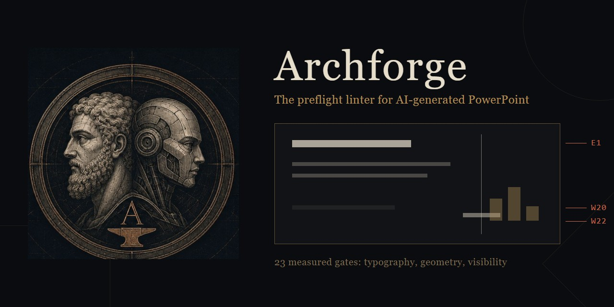
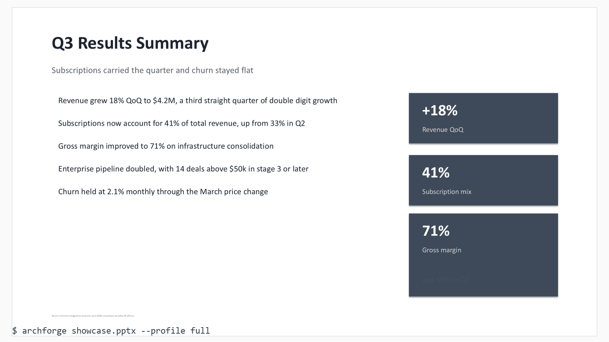
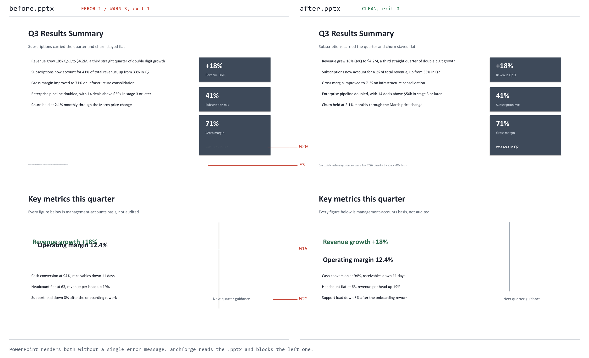
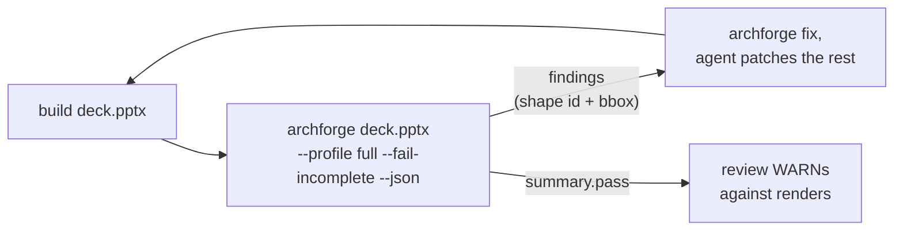

<div align="center">



**The preflight linter for AI-generated PowerPoint.**

Catches silent font fallback, unreadable sizes, colliding frames,
off-canvas text, text buried in same-color fills, and AI-tell
punctuation in built `.pptx` files, before a human ever sees a render. Font-fallback and letter-tracking
detection (E1/E4) is CJK-specific by design -- deepest for Hangul --
and does not fire on Latin-only decks, and the small-text rule W8 is
gated the same way; every other gate is script-independent.

**Try it in your browser -- no install, the deck never leaves the page:** [love-ash.github.io/archforge](https://love-ash.github.io/archforge/)

[](https://pypi.org/project/archforge/)


[](https://github.com/Love-Ash/archforge/actions/workflows/ci.yml)

[Quickstart](#30-seconds) · [What it catches](#what-it-catches) · [CI](#ci) · [Calibration record](docs/CALIBRATION.md) · [Corpus results](docs/ACCURACY.md) · [Discussions](https://github.com/Love-Ash/archforge/discussions) · [한국어 README](README.ko.md)

**AI agents / LLMs:** read [llms.txt](llms.txt), or `pip install archforge` then `archforge skill --install` to teach your agent the build-lint-fix loop.



<sub>The README assets use purpose-built showcase decks, not the decks produced by
`archforge demo` or an `archforge fix` run; reproduce the exact decks, renders, and
animation with `python scripts/make_readme_assets.py`.</sub>

</div>

PowerPoint opens both of these decks without a single warning. One of them is broken:

<picture>
  <source media="(prefers-color-scheme: dark)" srcset="docs/assets/showcase-en-dark.png">
  
</picture>

Code review cannot see any of it, because the defects live in font slots, autofit
scales, and coordinates that only materialize at render time. Archforge reads the
`.pptx` itself (XML, font-resolution chain, geometry, image alpha), so it needs no
PowerPoint installation and runs anywhere your agent or CI runs.

## 30 seconds

```bash
pip install archforge
archforge demo        # builds broken.pptx + fixed.pptx and lints both, in front of you
```

Then point it at your own deck:

```bash
archforge deck.pptx                 # objective defects only (core profile, the default)
archforge deck.pptx --profile full  # + AI-tell / style rules: machine-made decks want this
archforge deck.pptx --json          # machine-readable JSON (agents / CI)
archforge scan decks/ --profile full   # many files, directories, or globs in one run
```

The decks in [examples/](examples/) demonstrate the flagship defects and the profile
split, each with expected outputs.

> [!TIP]
> No terminal handy? Drop a deck on [love-ash.github.io/archforge](https://love-ash.github.io/archforge/)
> and every gate runs in your browser. The file never leaves the page.

## Why

The worst pptx defects are silent. No error is raised when:

- text lands on a font that lacks its glyphs and silently falls back to an OS default
  (the classic case: CJK text on a Latin-only font)
- positive letter-spacing quietly wrecks CJK character spacing
- autofit shrinks text below readable size
- text frames collide, or glyphs run off the canvas
- text ends up nearly the same color as whatever is drawn behind it: ghost
  placeholder text, a caption buried on a chart panel, a label lost against
  the slide background

These are exactly the defects machine-generated decks produce, and exactly the ones
an LLM cannot see in its own output. Archforge is the gate between "the build
succeeded" and "a human would sign off on the render." It is deliberately independent
of the authoring side: whether the deck came from python-pptx, PptxGenJS, OfficeCLI,
or PowerPoint itself, the same file goes in and the same exit code comes out, and the
[public corpus](corpus/) keeps fixtures from all four writers to enforce that.

## Usage

```bash
archforge deck.pptx --profile full --fail-incomplete --json   # the agent/CI command
archforge scan decks/ --profile full         # many files, dirs, or globs at once
archforge fix deck.pptx -o fixed.pptx        # the three mechanical fixes: font slot, tracking, dashes
archforge deck.pptx --html report.html       # annotated visual report
archforge deck.pptx --sarif o.sarif          # SARIF / --junit o.xml for CI systems
archforge rules                              # rule list; `archforge explain W15` for one
```

Every flag (thresholds, baseline, severity overrides, schema 2.0, timeout), the config
file, and the JSON contract: **[docs/USAGE.md](docs/USAGE.md)**. Recipes:
[Claude Code](docs/recipes/claude-code.md) ·
[Codex/agents](docs/recipes/codex.md) ·
[PptxGenJS](docs/recipes/pptxgenjs.md) ·
[OfficeCLI](docs/recipes/officecli.md) ·
[GitHub Actions](docs/recipes/github-actions.md).


## CI

GitHub Action (composite). Pinning the action tag pins the linter: by default it
installs the exact source checked out at that ref, not whatever PyPI's latest is.
Deck-folder config files are ignored (`--no-config`) and incomplete checks fail
(`fail-incomplete: true`) unless you opt out, so a PR cannot weaken the gate by
committing a config next to its deck. `files` takes one path, directory, or glob per
line; globs are expanded by `archforge scan` itself, so paths with spaces and `**`
both behave.

```yaml
jobs:
  deck-lint:
    runs-on: ubuntu-latest
    steps:
      - uses: actions/checkout@v4
      - uses: Love-Ash/archforge@v0.11.0
        with:
          files: |
            decks/
          profile: full
          sarif: archforge.sarif
      - uses: github/codeql-action/upload-sarif@v3
        if: always()
        with:
          sarif_file: archforge.sarif
```

pre-commit:

```yaml
repos:
  - repo: https://github.com/Love-Ash/archforge
    rev: v0.11.0
    hooks:
      - id: archforge
        # args: [--profile, full]
```

## What it catches

Every code links to its full story: what fires, what deliberately passes, and where
the threshold came from.

**ERRORs** block shipping (exit 1):

| Code | Catches |
|:----:|---------|
| [`E1`](docs/rules/E1.md) | The font that will actually render Hangul is Latin-only: silent Malgun fallback, resolved through a measured PowerPoint model |
| [`E2`](docs/rules/E2.md) | Dash-family characters as sentence punctuation, the top AI-deck tell. Numeric ranges and minus signs pass; `--strict` blocks all |
| [`E3`](docs/rules/E3.md) | Effective size below 5pt after autofit and the full inheritance chain |
| [`E4`](docs/rules/E4.md) | Positive tracking on consecutive Hangul/Hanja (tracked kana is exempt) |

**WARNs** are advisory:

| Code | Catches |
|:----:|---------|
| [`W1`](docs/rules/W1.md) | Body-class frame below 9pt |
| [`W5`](docs/rules/W5.md) | No font size anywhere in the inheritance chain |
| [`W6`](docs/rules/W6.md) | Same layout skeleton on 4+ pages |
| [`W7`](docs/rules/W7.md) | Low text-over-image contrast (needs `--render`) |
| [`W8`](docs/rules/W8.md) | Small CJK in narrow frames (device mockups, cards) |
| [`W9`](docs/rules/W9.md) | Accent vertical bars repeated as list markers |
| [`W10`](docs/rules/W10.md) | Hand-drawn diagram cloned across pages |
| [`W11`](docs/rules/W11.md) | AI-tell copy: buzzwords, stock openings |
| [`W12`](docs/rules/W12.md) | Footer baseline drift |
| [`W13`](docs/rules/W13.md) | Native PowerPoint shadow/glow/3D effects |
| [`W14`](docs/rules/W14.md) | Titles that are nominal phrases, not claims |
| [`W15`](docs/rules/W15.md) | Text-on-text overlap |
| [`W16`](docs/rules/W16.md) | Text glyphs or picture ink off-canvas |
| [`W17`](docs/rules/W17.md) | Text straddling an image ink edge |
| [`W18`](docs/rules/W18.md) | Spans that could not be checked: results incomplete, fails under `--strict` |
| [`W19`](docs/rules/W19.md) | Text nearly the color of its own fill: ghost placeholder text |
| [`W20`](docs/rules/W20.md) | Text buried on whatever is drawn behind it, down to the slide background and the inside of vector charts |
| [`W21`](docs/rules/W21.md) | A stray color painted right beside a near-identical dominant one: a mistyped hex |
| [`W22`](docs/rules/W22.md) | Text impaled on a hairline rule: an unintended strikethrough |

Between W1 and W8 sits a deliberate gap: text at 5.0-9.0pt in a frame that is neither
body-class nor narrow is not judged. Across 29 real decks, all 1,231 runs in that band
were page furniture and none were content, so a gate there would trade hundreds of
false positives for no measured catch. The measurement is re-runnable, and an outside
report of a real miss in that band is the most valuable fixture you can send.

### Profiles

| Profile | Runs | Built for |
|:--------|:-----|:----------|
| `core` (default) | the mechanical gates: E1/E3/E4, W1/W5/W7/W8, W15-W18 | any deck, zero style policy |
| `full` | everything: adds E2 dashes, W6 repetition, W9-W14, and the visibility gates W19-W22 while their thresholds soak | machine-generated decks and agent loops |
| `editorial` | `full` minus W6/W14 and the soaking W19-W22 | editorial and portfolio decks |

Excluded rules are not merely hidden, they are not executed, and every choice is
recorded in the JSON summary, so nothing is silently bypassed.

## How it works

The E1 font-resolution model is measured, not guessed from the OOXML spec: probe decks
rendered through PowerPoint COM pinned the actual priority (run `a:ea` > paragraph
defRPr > lstStyle chain > theme ea > `a:latin` on an empty theme slot > OS fallback).
Effective sizes walk the same chain; geometry approximates real glyph and image-ink
areas with insets, group transforms, and merged cells; incompleteness is a first-class
output (`W18` / `summary.incomplete`), so `summary.pass` under `--fail-incomplete` is
the honest gate. Font-coverage knowledge is Hangul-deep and CJK-aware; other scripts are
never falsely flagged; the target renderer is PowerPoint for Windows.

The visibility gates (W19-W22) read colors and geometry straight from the XML too.
What actually sits behind a run is resolved in descending paint order, so an upper
card claims its overlap before the page background is consulted; a chart carried as
an svgBlip vector picture is opened and judged inside; anything undecodable abstains
instead of guessing. Their thresholds were set the way the font model was: the 2.0:1
contrast line came from pulling every candidate across 29 real decks, and W21's
stray-color shape from 148.

Full model, calibration method, renderer-coverage matrix, and scope:
**[docs/HOW_IT_WORKS.md](docs/HOW_IT_WORKS.md)** and
[docs/CALIBRATION.md](docs/CALIBRATION.md). Roadmap to 1.0:
[docs/ROADMAP.md](docs/ROADMAP.md). What is stable and what may move:
[docs/DEPRECATION.md](docs/DEPRECATION.md).

## Agent integration

Designed for LLM-agent build-lint-fix loops:


```mermaid
flowchart LR
    A["build deck.pptx"] --> B["archforge deck.pptx<br/>--profile full --fail-incomplete --json"]
    B -->|"findings<br/>(shape id + bbox)"| C["archforge fix,<br/>agent patches the rest"]
    C --> A
    B -->|"summary.pass"| D["review WARNs<br/>against renders"]
```

`summary.pass` reflects the active policy (`summary.policy`), and every finding's
location payload points at the exact shape and run, so the fixing side never has to
search for what the linter meant.

The Agent Skills pack (standard SKILL.md + YAML frontmatter) teaches this loop and
per-code fixes to any supporting agent (Claude Code, Codex, ...). It ships inside the
wheel: `archforge skill --install`. If you cloned the repo, `skills/archforge-pptx-lint/`
is the same file.

A passing lint is not a finished deck: the linter owns the mechanical defect class;
composition and narrative still need eyes on renders.

## Community and contributing

- Found a false positive? [Report it with the FP template](https://github.com/Love-Ash/archforge/issues/new/choose): a repro deck makes it a permanent regression fixture, the most valuable contribution this project takes.
- Questions, ideas, decks you are unsure about: [GitHub Discussions](https://github.com/Love-Ash/archforge/discussions).
- Want to contribute code? [CONTRIBUTING.md](CONTRIBUTING.md) explains the evidence bar (gates are calibrated against renders, not taste); issues tagged [good first issue](https://github.com/Love-Ash/archforge/issues?q=is%3Aissue+is%3Aopen+label%3A%22good+first+issue%22) are scoped for a first PR.
- Security: [SECURITY.md](SECURITY.md).

## Name

archforge = arch (structure) + forge. A forge where a deck's structure and typography
get hammered straight before shipping.

## Author

Built and calibrated by **Minjae Kwon (Ash)**
([@Love-Ash](https://github.com/Love-Ash) · [LinkedIn](https://www.linkedin.com/in/a5h/)).
If archforge caught something before your audience did, a star helps the next person
find it. I write up the measurement work behind the gates (how PowerPoint actually
resolves fonts, and what AI-built decks silently break); say hi on LinkedIn.

## License

MIT © Minjae Kwon (Ash)
